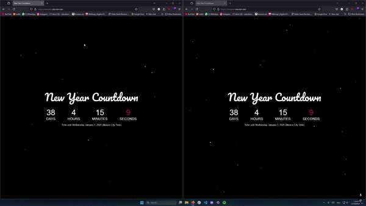

# New-Year-Countdown
Website that counts down to new years eve. It has a countdown timer with days, hours, minutes, and seconds remaining to the new year.

---
It allows you to shoot fireworks by clicking the screen anywhere you like. It also shows the fireworks you launched to other users in the webpage.

Check it out: [New Year Countdown](https://newyear.cdavidsv.dev/)

---

<p align="center">
  
  
  
</p>

---
## How to Run Locally with Docker

### Backend (Go server)

1. Build and run the backend Docker container:
  ```sh
  cd server
  docker build -t new-year-ws .
  docker run -p 4000:4000 --name new-year-ws new-year-ws
  ```

  This will start the backend server on port 4000.

**Note:** You need to create a `.env` file in the `server` directory with the required environment variables before running the backend. Example:
```sh
ALLOWED_DOMAINS="http://localhost:5173"
```

### Frontend (Vite app)

1. Install dependencies and run the frontend locally:
  ```sh
  cd frontend
  npm install
  npm run dev
  ```

  The frontend will start on port 5173 by default (see Vite config).

2. Open your browser and go to [http://localhost:5173](http://localhost:5173).
